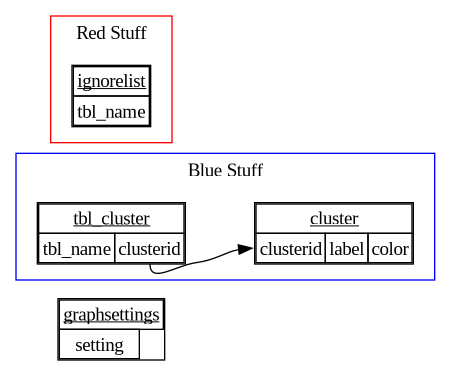

# README for sqlite3todot


If ever there were some itch-scratching going on, this would be it. This
is a simple tool to create .dot directed graphs from sqlite3 databases.

It can optionally include things like clustering, and tables to ignore,
from a "meta" database.

To build:
```sh
gcc -o sqlite3todot -lsqlite3 sqlite3todot.c
```

As an example to run, rendering the example meta database, with the meta
database as the meta database for that example meta [I can't go on]:
```sh
cat meta.sql | sqlite3 meta.db
./sqlite3todot meta.db meta.db > verymeta.dot
dot -Tpng -overymeta.png verymeta.dot
```

Which generates this image:


Alternatively, there's a script called "testlayouts.sh" that renders
all of the layouts graphviz has at time of writing. Simply pass it the
dot file you created before, and open the file it suggests:
```sh
sh ./testlayouts.sh ./verymeta.dot
```


Gary "ChunkyKs" Briggs <chunky@icculus.org>

